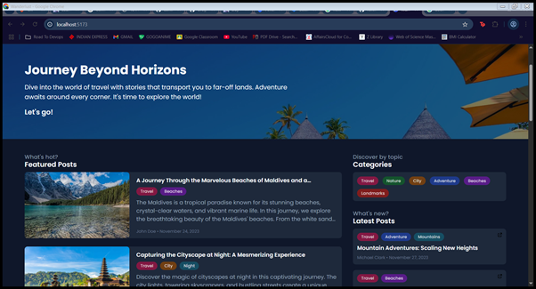
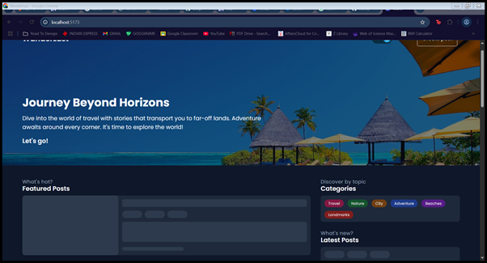

#  Wanderlust Travel Blog — Full Stack App with Docker & Docker Compose

This project is a fully containerized **travel blog app** with:

- Node.js (Express backend)
- React (Vite frontend)
- MongoDB (Database)
- Docker + Docker Compose for orchestration

---

## Getting Started

These steps will help you **clone, set up, and run** the application locally using Docker.

### 1. Clone the Repository

```bash
git clone https://github.com/arnab-logs/containerize-wanderlust-blog-app.git
cd wanderlust-travel-blog
````

---

### 2. Build and Start the App with Docker Compose

```bash
docker compose up -d --build
```

This will:

* Build the backend and frontend images
* Start 3 containers:

  * `backend` (Node API on port 5000)
  * `frontend` (React UI on port 5173)
  * `mongodb` (MongoDB on port 27017)

---

### 3. Import Sample Data into MongoDB

The blog app expects data to be present in the database. You can import the sample blog posts like this:

```bash
docker exec -it mongodb mongoimport \
  --db wanderlust \
  --collection posts \
  --file ./data/sample_posts.json \
  --jsonArray
```

You should see:

```
connected to: mongodb://localhost/
10 document(s) imported successfully. 0 document(s) failed to import.
```

---

### 4. View the App

Open your browser and go to:

 **Frontend:** [http://localhost:5173](http://localhost:5173)
 **Backend (optional):** [http://localhost:5000](http://localhost:5000)

You should see blog posts with images loaded!

---

## Project Structure

```
.
├── backend/
│   ├── Dockerfile
│   ├── .env.sample
│   └── data/
│       └── sample_posts.json
├── frontend/
│   ├── Dockerfile
│   └── .env.sample
├── docker-compose.yml
├── LICENSE
└── README.md
```

---

## Environment Configuration

### `backend/.env.sample`

```env
MONGODB_URI=mongodb://mongodb/wanderlust
CORS_ORIGIN=http://localhost:5173
REDIS_URL=127.0.0.1:6379
```

---

## Dockerfiles

### `backend/Dockerfile`

```Dockerfile
FROM node:21

WORKDIR /app

COPY . .

RUN npm i

COPY .env.sample .env

EXPOSE 5000

CMD ["npm", "start"]
```

### `frontend/Dockerfile`

```Dockerfile
FROM node:21

WORKDIR /app

COPY . .

RUN npm i

COPY .env.sample .env.local

EXPOSE 5173

CMD ["sh", "-c", "npm run dev -- --host"]
```

---

## Docker Compose File

```yaml
version: "3.8"

services:
  backend:
    container_name: backend
    build: ./backend
    env_file:
      - ./backend/.env.sample
    ports:
      - "5000:5000"
    depends_on:
      - mongodb

  mongodb:
    container_name: mongodb
    image: mongo:latest
    volumes:
      - ./backend/data:/data
    ports:
      - "27017:27017"

  frontend:
    container_name: frontend
    build: ./frontend
    env_file:
      - ./backend/.env.sample
    ports:
      - "5173:5173"

volumes:
  data:
```

---

##  Common Issues & Fixes

###  Frontend stuck on “Loading…”

* **Cause:** API calls failed — backend couldn’t connect to MongoDB.

* **Fix:** Ensure `MONGODB_URI` in backend env is:

  ```env
  mongodb://mongodb/wanderlust
  ```

  (Use the container name `mongodb`, not `localhost`)

---

###  CORS Error: `strict-origin-when-cross-origin`

* **Cause:** Frontend (port 5173) trying to talk to backend (port 5000)
* **Fix:**

  * Installed `cors` in the backend
  * Set this in `.env.sample`:

    ```env
    CORS_ORIGIN=http://localhost:5173
    ```

---

###  Frontend CMD error: `[npm,: not found`

* **Cause:** CMD syntax issue in `Dockerfile`
* **Fix:** Use shell to run the command:

  ```Dockerfile
  CMD ["sh", "-c", "npm run dev -- --host"]
  ```

---

###  Posts disappeared after restarting containers

* **Cause:** `docker compose down` removed MongoDB data
* **Fix:** Re-run the `mongoimport` command


## Tips for Troubleshooting

* Use `docker logs <container>` to check app logs
* Use `docker exec -it <container> bash` to debug inside a container
* Always double-check `.env` paths and port bindings
* Rebuild containers if you change environment variables:

  ```bash
  docker compose down
  docker compose up -d --build
  ```

